# Binary Tree Data Structures

My personal notes and implementation details for Binary Trees, including theory analysis, recursive vs. iterative approaches, and traversal algorithms.

---

## Table of Contents

- [1. Theory Analysis](#1-theory-analysis)
  - [Terminology](#terminology)
  - [Binary Tree](#binary-tree)
  - [Mathematical Properties](#mathematical-properties)
  - [Strict & Complete Trees](#strict--complete-trees)
- [2. Recursive Execution Trace (Preorder)](#2-recursive-execution-trace-preorder)
- [3. Traversal Types Overview](#3-traversal-types-overview)
- [4. Iterative Traversals (Using Stack)](#4-iterative-traversals-using-stack)
- [5. Level Order Traversal (Using Queue)](#5-level-order-traversal-using-queue)

---

## 1. Theory Analysis

A **Tree** is simply a collection of nodes where one node is designated as the **Root**, and the rest of the nodes are disjoint subsets (sub-trees).

* **n nodes** → **(n-1) edges**

### Terminology

* **Siblings:** Children of the same parent
* **Descendants:** All children recursively (children, their children, etc.)
* **Ancestors:** All nodes along the path from a specific node up to the Root
* **Node Degree:** Number of children a specific node has
* **Tree Degree:** The maximum degree found among all nodes in the tree
* **Leaf (External) Node:** A node with degree zero
* **Level:** Number of nodes in the path from Root (1) to the node (L)
* **Height:** Number of edges in the longest path from Root (0) to a leaf (H)
* **Forest:** A collection of trees that can be combined into one tree

### Binary Tree

A Binary Tree is strictly a **2nd degree Tree** (each node has at most 2 children).

### Mathematical Properties

#### 1. Generating Shapes from Unlabeled Nodes

**Observation:** If we have 3 nodes, we can generate 5 different binary tree shapes.

* T(3) = 5
* T(4) = 14

This follows the **Catalan Number** sequence:

$$T(n) = \frac{1}{n+1} \binom{2n}{n}$$

```mermaid
graph TD
    subgraph "Catalan Numbers: Binary Tree Shapes"
        
        subgraph "n = 3 generates T(3) = 5 shapes"
            
            subgraph Shape1["Shape 1"]
                A1((•))
                B1((•))
                C1((•))
                A1 --- B1
                B1 --- C1
            end
            
            subgraph Shape2["Shape 2"]
                A2((•))
                B2((•))
                C2((•))
                A2 --- B2
                A2 --- C2
            end
            
            subgraph Shape3["Shape 3"]
                A3((•))
                B3((•))
                C3((•))
                A3 --- B3
                B3 --- C3
            end
            
            subgraph Shape4["Shape 4"]
                A4((•))
                B4((•))
                C4((•))
                A4 --- B4
                A4 --- C4
            end
            
            subgraph Shape5["Shape 5"]
                A5((•))
                B5((•))
                C5((•))
                A5 --- B5
                B5 --- C5
            end
        end
        
        Formula["T(n) = (2n)! / ((n+1)! × n!)"]
    end
```



#### 2. Height vs. Nodes

* **Number of nodes with Max height:** $2^{(n-1)}$
* **Min Nodes for height h:** $h + 1$
* **Max Nodes for height h:** $2^{(h+1)} - 1$

#### 3. Node Degree Relationship

In any binary tree, the number of leaf nodes ($N_0$) is related to nodes with two children ($N_2$):

$$N_0 = N_2 + 1$$

**Where:**
- $N_0$ = nodes with degree 0 (leaf nodes)
- $N_2$ = nodes with degree 2 (internal nodes with two children)

### Strict & Complete Trees

* **Strict Binary Tree:** Every node has either 0 or 2 children (no node has degree 1)
    * Formula: $\text{External} = \text{Internal} + 1$
* **Full Binary Tree:** A tree with the maximum possible number of nodes for its height
* **Complete Binary Tree:** A tree where all levels are completely filled except possibly the last, which is filled from left to right
    * *Note:* Every Full BT is Complete, but not every Complete BT is Full

---

## 2. Recursive Execution Trace (Preorder)

Visualizing how the stack and recursion work for `pre(200)`.

```mermaid
flowchart TB
    %% --- Layout Definitions ---
    subgraph LeftColumn ["Execution Trace & Stack"]
        direction TB

        %% 1. The Recursion Tree (Top Left)
        subgraph Trace ["Recursion Tree Execution"]
            direction TB
            N1("pre(200)<br/>🔴1")
            
            %% Level 2
            N2("pre(210)<br/>🔴2")
            N9("pre(230)<br/>🔴9")
            
            %% Level 3 (Left Subtree)
            N3("pre(270)<br/>🔴3")
            N6("pre(300)<br/>🔴6")
            
            %% Level 3 (Right Subtree)
            N10("pre(310)<br/>🔴10")
            N13("pre(320)<br/>🔴13")

            %% Connections
            N1 --> N2 & N9
            N2 --> N3 & N6
            N9 --> N10 & N13

            %% Leaves (Null Calls)
            N3 --> L1["p(0) 🔴4"] & L2["p(0) 🔴5"]
            N6 --> L3["p(0) 🔴7"] & L4["p(0) 🔴8"]
            N10 --> L5["p(0) 🔴11"] & L6["p(0) 🔴12"]
            N13 --> L7["p(0) 🔴14"] & L8["p(0) 🔴15"]
        end

        %% 2. The Stack (Bottom Left)
        subgraph Stack ["Stack Memory"]
            direction BT
            S1["| t=200 |"] 
            S2["| t=210 |"]
            S3["| t=270 |"]
            S4["| t=0 | ❌"]
            
            S1 --- S2 --- S3 --- S4
        end
        
        Complexity["Time Complexity:<br/>n + (n+1) = 2n + 1 = O(n)"]
    end

    %% --- Right Column ---
    subgraph RightColumn ["Code & Data Tree"]
        direction TB
        
        %% 3. Code Snippet (Top Right)
        subgraph Code ["C++ Implementation"]
            CodeBlock["void Preorder(Node *t) {<br/>&nbsp;&nbsp;if(t != NULL) {<br/>&nbsp;&nbsp;&nbsp;&nbsp;1. print(t->data)<br/>&nbsp;&nbsp;&nbsp;&nbsp;2. Preorder(t->left)<br/>&nbsp;&nbsp;&nbsp;&nbsp;3. Preorder(t->right)<br/>&nbsp;&nbsp;}<br/>}"]
        end

        %% 4. Data Tree (Bottom Right)
        subgraph DataTree ["Actual Tree in Memory"]
            direction TB
            ROOT(("8<br/>[200]"))
            L_Child(("3<br/>[210]"))
            R_Child(("5<br/>[230]"))
            
            LL(("4<br/>[270]"))
            LR(("9<br/>[300]"))
            RL(("7<br/>[310]"))
            RR(("2<br/>[320]"))

            ROOT --> L_Child & R_Child
            L_Child --> LL & LR
            R_Child --> RL & RR
        end
        
        Output["Output: 8, 3, 4, 9, 5, 7, 2"]
    end
```



**Key Insight:** The recursion tree shows the order of function calls (numbered 1-15), demonstrating how the call stack grows and shrinks during execution.

---

## 3. Traversal Types Overview

A visual comparison of Preorder, Inorder, Postorder, and Level Order traversals on different tree shapes.

```mermaid
flowchart TB
    %% Main Container
    subgraph Main ["Tree Traversals Comparison"]
        direction TB

        %% Top Section: The Three Examples
        subgraph Examples ["Visual Examples"]
            direction LR

            %% Case 1: Full Tree
            subgraph Ex1 ["Case 1: Full Node"]
                direction TB
                A1((A)) --> B1((B))
                A1 --> C1((C))
                
                Res1["✦ Pre: A, B, C<br/>✦ In: B, A, C<br/>✦ Post: B, C, A<br/>✦ Level: A, B, C"]
            end

            %% Case 2: Left Skewed
            subgraph Ex2 ["Case 2: Left Child Only"]
                direction TB
                A2((A)) --> B2((B))
                
                Res2["✦ Pre: A, B<br/>✦ In: B, A<br/>✦ Post: B, A<br/>✦ Level: A, B"]
            end

            %% Case 3: Right Skewed
            subgraph Ex3 ["Case 3: Right Child Only"]
                direction TB
                A3((A)) --> B3((B))
                
                Res3["✦ Pre: A, B<br/>✦ In: A, B<br/>✦ Post: B, A<br/>✦ Level: A, B"]
            end
        end

        %% Bottom Section: Definitions
        subgraph Rules ["Traversal Definitions"]
            direction TB
            D1["Preorder: visit(node) → Preorder(left) → Preorder(right)"]
            D2["Inorder: Inorder(left) → visit(node) → Inorder(right)"]
            D3["Postorder: Postorder(left) → Postorder(right) → visit(node)"]
            D4["Level Order: Visit nodes level by level BFS"]
        end
    end

    Examples --> Rules
```



### Traversal Summary

| Traversal | Order | Use Case |
|-----------|-------|----------|
| **Preorder** | Root → Left → Right | Copy tree, prefix expression |
| **Inorder** | Left → Root → Right | BST sorted output |
| **Postorder** | Left → Right → Root | Delete tree, postfix expression |
| **Level Order** | Level by level | BFS, find shortest path |

---

## 4. Iterative Traversals (Using Stack)

> **Key Principle:** To convert recursive traversal to iteration, we must use a **Stack** to remember the nodes we need to return to.

### A. Preorder Iteration

**Algorithm Steps:**

1. Print root → Push to Stack → Go Left
2. Continue until NULL
3. When NULL: Pop from Stack → Go Right


**Implementation:**

```cpp
void PreorderIteration(Node* t) {
    Stack st;
    
    while (t != NULL || !st.isEmpty()) {
        if (t != NULL) {
            printf("%d ", t->data);  // Print BEFORE pushing
            st.push(t);
            t = t->left;
        }
        else {
            t = st.pop();
            t = t->right;
        }
    }
}
```

### B. Inorder Iteration

The logic is similar to Preorder, but we **defer printing** until we pop the node from the stack (meaning we have finished the left subtree).

**Implementation:**

```cpp
void InorderIteration(Node* t) {
    Stack st;
    
    while (t != NULL || !st.isEmpty()) {
        if (t != NULL) {
            st.push(t);              // Push, but DON'T print yet
            t = t->left;
        }
        else {
            t = st.pop();
            printf("%d ", t->data);  // Print AFTER popping (returning from left)
            t = t->right;
        }
    }
}
```

**Key Difference:**
- **Preorder:** Print → Push → Go Left
- **Inorder:** Push → Go Left → Pop → Print → Go Right

### C. Postorder Iteration (Two-Stack Method)

Postorder is hard iteratively because we visit the Root twice (before Right, and after Right). The easiest way is to implement **Reverse Preorder** (Root → Right → Left) and store it in a second stack to print in reverse.

**Algorithm:**
1. Use Stack 1 for traversal (Root → Right → Left)
2. Use Stack 2 to store nodes for reverse printing
3. Pop Stack 2 to get correct order (Left → Right → Root)

**Implementation:**

```cpp
void PostorderIteration(Node* t) {
    if (t == NULL) return;
    
    Stack st1, st2;
    st1.push(t);

    while (!st1.isEmpty()) {
        t = st1.pop();
        st2.push(t);  // Store for later (don't print yet)

        // Push Left then Right (so Right is processed first by st1)
        if (t->left) st1.push(t->left);
        if (t->right) st1.push(t->right);
    }

    // Print st2 in reverse (Left → Right → Root)
    while (!st2.isEmpty()) {
        t = st2.pop();
        printf("%d ", t->data);
    }
}
```

---

## 5. Level Order Traversal (Using Queue)

Level Order prints data level by level. This requires a **Queue** (FIFO - First In First Out).

### Algorithm

1. Print Root → Enqueue Root
2. While Queue is not empty:
   * Dequeue `p`
   * If `p->left` exists: Print it, then Enqueue it
   * If `p->right` exists: Print it, then Enqueue it

### Visualization


### Implementation

```cpp
void Tree::levelorderTraversal(Node* p) {
    if (p == NULL) return;

    Queue q; 

    // Initial Setup
    printf("%d ", p->data);
    q.enqueue(p);

    while (!q.isEmpty()) {
        p = q.dequeue();

        if (p->left != NULL) {
            printf("%d ", p->left->data);
            q.enqueue(p->left);
        }

        if (p->right != NULL) {
            printf("%d ", p->right->data);
            q.enqueue(p->right);
        }
    }
}
```

### Example Execution

For tree:
```
      8
     / \
    3   5
   / \ / \
  4  9 7  2
```

**Queue State Evolution:**

| Step | Queue | Printed |
|------|-------|---------|
| 1 | [8] | 8 |
| 2 | [3, 5] | 8, 3, 5 |
| 3 | [5, 4, 9] | 8, 3, 5, 4, 9 |
| 4 | [4, 9, 7, 2] | 8, 3, 5, 4, 9, 7, 2 |
| 5 | [] | Done |

---

## Summary

### Comparison Table

| Traversal | Data Structure | Time | Space | Print Timing |
|-----------|----------------|------|-------|--------------|
| Preorder (Iterative) | Stack | O(n) | O(h) | Before push |
| Inorder (Iterative) | Stack | O(n) | O(h) | After pop |
| Postorder (Iterative) | 2 Stacks | O(n) | O(n) | Reverse order |
| Level Order | Queue | O(n) | O(w) | As dequeued |

**Where:**
- h = height of tree
- w = maximum width of tree
- n = number of nodes

### Key Takeaways

**Recursive to Iterative:** Use Stack for DFS traversals (Preorder, Inorder, Postorder)

**Level Order:** Use Queue for BFS traversal

**Catalan Numbers:** Count structurally unique binary trees for n nodes

**Degree Relationship:** $N_0 = N_2 + 1$ (leaves = internal nodes with 2 children + 1)

**Preorder:** Print while going down (diving left)

**Inorder:** Print while coming back up (after visiting left subtree)

**Postorder:** Print after visiting both subtrees (requires two stacks for iteration)


---

# Binary Search Tree (BST)

A Binary Search Tree is a Binary Tree in which for every node, elements in the left subtree are smaller than elements in the right subtree.

## Properties

* **No Duplicates** — Each element appears only once in the tree
* **Inorder Traversal Gives Sorted Order** — Traversing the tree in inorder produces elements in ascending order
* **Number of Different Shapes** — For `n` nodes, the number of different BST shapes that can be generated equals the Catalan Number:
  
  $$T(n) = \frac{2nCn}{n+1}$$
  
  > **Note:** Each shape has only one arrangement of nodes

---

## Searching for a Key

### Algorithm

Start comparing with the root. If the key is less than the root, go left; if greater, go right. Repeat until you find the key or reach `NULL`.

The number of comparisons depends on the height of the tree: **O(h)**

From Binary Tree properties, we know that:

$$\log(n) \leq h \leq n$$

Therefore:

$$O(\log n) \leq \text{Time Complexity} \leq O(n)$$

We assume the minimum (best case) time complexity is **O(log n)**.

### Recursive Search

```cpp
TreeNode* searchBSTRecursive(TreeNode* root, int key){
	if(root == nullptr)
		return nullptr;
		
	if(key == root->data)
		return root;
	else if(key < root->data)
		return searchBSTRecursive(root->left, key);
	else
		return searchBSTRecursive(root->right, key);
}
```

### Iterative Search

```cpp
TreeNode* searchBSTIteration(TreeNode* root, int key) {
    while (root) {
        if (key == root->data)
            return root;
        else if (key < root->data)
            root = root->left;
        else
            root = root->right;
    }
    return nullptr;
}
```

> **Note:** We don't always need a stack to convert recursion to iteration. In this case, we don't need to remember each visited parent.

---

## Inserting a Node

Insertion is similar to the search algorithm. When we reach `NULL`, that's the right place for the inserted node.

### Recursive Insert

```cpp
TreeNode* insertBSTRecursive(TreeNode* root, int key) {
    if (root == nullptr) {
        return new TreeNode(key);
    }

    if (key < root->data) {
        root->left = insertBSTRecursive(root->left, key);
    }
    else if (key > root->data) {
        root->right = insertBSTRecursive(root->right, key);
    }

    return root;
}
```

### Iterative Insert

```cpp
TreeNode* insertBSTIteration(TreeNode* root, int key) {
    // Case 1: empty tree
    if (root == nullptr)
        return new TreeNode(key);

    TreeNode* curr = root;
    TreeNode* parent = nullptr;

    while (curr) {
        parent = curr;

        if (key < curr->data)
            curr = curr->left;
        else if (key > curr->data)
            curr = curr->right;
        else
            return root;  // key already exists (no insertion)
    }

    TreeNode* newNode = new TreeNode(key);

    if (key < parent->data)
        parent->left = newNode;
    else
        parent->right = newNode;

    return root;
}
```

---

## Creating a Binary Search Tree from an Array of Keys

### Problem Statement

Construct a Binary Search Tree (BST) from a given array of keys.

**Input Keys:**

```
[9, 15, 5, 20, 16, 8, 12, 3, 6]
```

### Algorithm

To build the tree, we take the first element as the **Root**. For every subsequent element, we follow these steps:

1. **Start at the Root**
2. **Compare** the new key with the current node's value:
   - If **Key < Node**: Move to the **Left** child
   - If **Key > Node**: Move to the **Right** child
3. **Repeat** step 2 until you reach a `NULL` pointer (an empty spot)
4. **Insert** the new key at that position

### Visual Example (From Input)

Here is the resulting structure based on the input keys:


### Trace Example (Inserting 16)

To understand the placement of node `16`:

1. Compare with Root `9`: $16 > 9$ → Go **Right**
2. Compare with `15`: $16 > 15$ → Go **Right**
3. Compare with `20`: $16 < 20$ → Go **Left**
4. Spot is empty → **Insert 16**

### Time Complexity Analysis

The cost of building the tree is calculated by multiplying the number of elements by the cost of finding the insertion spot for each element.

$$\text{Total Time} = (\text{Number of Elements}) \times (\text{Cost to Search/Insert})$$

- **Number of insertions:** $n$
- **Cost per insertion:** Proportional to the height of the tree, which is roughly $\log n$ (for a balanced tree)

$$O(n) \times O(\log n) = O(n \log n)$$

> **Note:** In the worst-case scenario (if the array was already sorted, e.g., 1, 2, 3, 4...), the height would be $n$, making the complexity $O(n^2)$. However, for random data, it averages to $O(n \log n)$.

---

## Deleting a Node from BST

The deletion process depends on the node's structure:

* **If the node is a leaf:** Simply delete it and connect the parent to `NULL`
* **If the node has only one child:** Replace it with its child
* **If the node has two children:** Find either the **Inorder Successor** or **Inorder Predecessor** and replace the node with it

### Finding Predecessors and Successors

**How to get the Inorder Predecessor?**
→ Find the *rightmost child of the left subtree*

**How to get the Inorder Successor?**
→ Find the *leftmost child of the right subtree*

---

## License

© 2026 [Your Name]. All Rights Reserved.

This educational material is provided for personal learning purposes only.

---
