# Binary Tree - Theory & Implementation

## Table of Contents
- [Tree Fundamentals](#tree-fundamentals)
- [Binary Tree Basics](#binary-tree-basics)
- [Catalan Numbers](#catalan-numbers)
- [Tree Properties](#tree-properties)
- [Tree Representations](#tree-representations)
- [Tree Traversals](#tree-traversals)
- [Iterative Implementations](#iterative-implementations)

---

## Tree Fundamentals

A **Tree** is simply a collection of nodes where one node takes the role as **root node** and the rest of the nodes are disjoint subsets, where each subset is a tree or subtree.

### Key Terminology

- **n nodes** → **(n-1) edges**
- **Siblings** → children of the same parent
- **Descendants** → all children and their children (recursively)
- **Ancestors** → all nodes in the path from a node to the Root
- **Node degree** → number of children of this node
- **Tree degree** → max degree of any node in the tree
- **Leaf (External) Node** → node with degree zero
- **Level** → number of nodes in the path from root (1→L)
- **Height** → number of edges in the path (0→H)
- **Forest** → collection of trees that can be combined into one tree

---

## Binary Tree Basics

**Binary Tree**: A tree where each node has at most 2 children (2nd degree tree)

---

## Catalan Numbers

### The Problem
**How many binary tree shapes can be generated from n non-labeled nodes?**

### Observation
From 3 nodes, we can generate **5 different binary tree shapes**:
- T(3) = 5
- T(4) = 14
- T(5) = 42

```mermaid
graph TD
    subgraph "n=3: Five Binary Tree Shapes"
        
        subgraph T1["Tree 1"]
            A1((•))
            B1((•))
            C1((•))
            A1 --- B1
            B1 --- C1
        end
        
        subgraph T2["Tree 2"]
            A2((•))
            B2((•))
            C2((•))
            A2 --- B2
            A2 --- C2
        end
        
        subgraph T3["Tree 3"]
            A3((•))
            B3((•))
            C3((•))
            A3 --- B3
            B3 --- C3
        end
        
        subgraph T4["Tree 4"]
            A4((•))
            B4((•))
            C4((•))
            A4 --- B4
            A4 --- C4
        end
        
        subgraph T5["Tree 5"]
            A5((•))
            B5((•))
            C5((•))
            A5 --- B5
            B5 --- C5
        end
    end
```



### Catalan Number Formula

**For Non-Labeled Nodes:**
```
T(n) = (2nCn) / (n+1)
```

**Recursive Formula:**
```
T(n) = Σ T(i-1) × T(n-i)  for i=1 to n
```

**For Labeled Nodes:**
```
T(n) = [(2nCn) / (n+1)] × n!
```

### Table of Values

| n | 0 | 1 | 2 | 3 | 4 | 5 | 6 |
|---|---|---|---|---|---|---|---|
| T(n) | 1 | 1 | 2 | 5 | 14 | 42 | 132 |

**Pattern Found:**
```
T(6) = 1×42 + 1×14 + 2×5 + 5×2 + 14×1 + 42×1 = 132
```

---

## Tree Properties

### Height to Nodes Relationship

**If we have height h, what is the min and max number of nodes?**
- **Min Nodes** = h + 1
- **Max Nodes** = 2^(h+1) - 1

**Number of nodes with max height:**
```
Max nodes at height h = 2^(h-1)
```

### Degree Relationship (Important!)

**Observation:** Number of nodes with degree 0 equals number of nodes with degree 2 + 1
```
deg(0) = deg(2) + 1
```

### Strict Binary Tree

A binary tree is **Strict** iff all nodes have degree 0 or degree 2 (cannot be 1)

**In strict binary tree:**
```
Number of external nodes = Number of internal nodes + 1
e = i + 1
```

**Strict 3-ary Tree:** All nodes have degree 0 or degree 3 only

---

## Tree Representations

### Array Representation

We can represent Binary Trees by filling an array **level by level**.

**Key Formulas:**
```
For node at index i:
- Left Child = 2i
- Right Child = 2i + 1
- Parent = floor(i/2)
```

### Linked Representation

Using Doubly Linked List structure:
```cpp
struct Node {
    Node* left;
    int data;
    Node* right;
};
```

### Tree Types

- **Complete Binary Tree:** When represented in an array, there are no blank places in between
- **Full Binary Tree:** Has the maximum number of nodes (2^(h+1) - 1)

**Note:** 
- All Full BT are Complete BT by nature
- Not every Strict BT is Complete and vice versa (arrangement determines this)

---

## Tree Traversals

### Visual Examples


### Traversal Definitions

**Preorder:** `visit(node) → Preorder(left) → Preorder(right)`

**Inorder:** `Inorder(left) → visit(node) → Inorder(right)`

**Postorder:** `Postorder(left) → Postorder(right) → visit(node)`

**Level Order:** Visit nodes level by level (Breadth-First)

---

## Iterative Implementations

### Preorder Traversal - Recursive Visualization

```mermaid
flowchart TB
    %% --- Layout Definitions ---
    subgraph LeftColumn ["Execution Trace & Stack"]
        direction TB

        %% 1. The Recursion Tree (Top Left)
        subgraph Trace ["Recursion Tree (Execution)"]
            direction TB
            N1("pre(200)<br/>🔴1")
            
            %% Level 2
            N2("pre(210)<br/>🔴2")
            N9("pre(230)<br/>🔴9")
            
            %% Level 3 (Left Subtree)
            N3("pre(270)<br/>🔴3")
            N6("pre(300)<br/>🔴6")
            
            %% Level 3 (Right Subtree)
            N10("pre(310)<br/>🔴10")
            N13("pre(320)<br/>🔴13")

            %% Connections
            N1 --> N2 & N9
            N2 --> N3 & N6
            N9 --> N10 & N13

            %% Leaves (Null Calls)
            N3 --> L1["p(0) 🔴4"] & L2["p(0) 🔴5"]
            N6 --> L3["p(0) 🔴7"] & L4["p(0) 🔴8"]
            N10 --> L5["p(0) 🔴11"] & L6["p(0) 🔴12"]
            N13 --> L7["p(0) 🔴14"] & L8["p(0) 🔴15"]
        end

        %% 2. The Stack (Bottom Left)
        subgraph Stack ["Stack Memory"]
            direction BT
            S1["| t=200 |"] 
            S2["| t=210 |"]
            S3["| t=270 |"]
            S4["| t=0 | ❌"]
            
            S1 --- S2 --- S3 --- S4
        end
        
        Complexity["⏱️ Time: n + (n+1) = 2n + 1 = O(n)"]
    end

    %% --- Right Column ---
    subgraph RightColumn ["Code & Data Tree"]
        direction TB
        
        %% 3. Code Snippet (Top Right)
        subgraph Code ["C++ Code"]
            CodeBlock["void Preorder(Node *t) {<br/>&nbsp;&nbsp;if(t != NULL) {<br/>&nbsp;&nbsp;&nbsp;&nbsp;1. print(t->data)<br/>&nbsp;&nbsp;&nbsp;&nbsp;2. Preorder(t->left)<br/>&nbsp;&nbsp;&nbsp;&nbsp;3. Preorder(t->right)<br/>&nbsp;&nbsp;}<br/>}"]
        end

        %% 4. Data Tree (Bottom Right)
        subgraph DataTree ["Actual Tree (Memory)"]
            direction TB
            ROOT(("8<br/>[200]"))
            L_Child(("3<br/>[210]"))
            R_Child(("5<br/>[230]"))
            
            LL(("4<br/>[270]"))
            LR(("9<br/>[300]"))
            RL(("7<br/>[310]"))
            RR(("2<br/>[320]"))

            ROOT --> L_Child & R_Child
            L_Child --> LL & LR
            R_Child --> RL & RR
        end
        
        Output["📤 Output: 8, 3, 4, 9, 5, 7, 2"]
    end
```



### Preorder Traversal - Iterative Approach

**Problem:** We want to iterate between steps 1 and 2 (print then go left, print then go left... until NULL), and go backward to the right of each reached node. But how do we remember reached nodes to go right? We need a **Stack**!

> **Key Insight:** To transfer recursive traversal to iteration, we must use a Stack

**Algorithm:**
1. Print data → push to stack → go left... repeat until NULL
2. When NULL: pop from stack → go right... return to step 1

```cpp
void PreorderIteration(Node* t) {
    Stack st;
    
    while (t != NULL || !st.isEmpty()) {
        if (t != NULL) {
            printf("%d ", t->data);
            st.push(t);
            t = t->left;
        }
        else {
            t = st.pop();
            t = t->right;
        }
    }
}
```

**Flowchart:**


### Inorder Traversal - Iterative Approach

**In-order uses the same approach, but we print before going right (while going backward):**

```cpp
void InorderIteration(Node* t) {
    Stack st;
    
    while (t != NULL || !st.isEmpty()) {
        if (t != NULL) {
            st.push(t);
            t = t->left;
        }
        else {
            t = st.pop();
            printf("%d ", t->data);  // Print while backtracking!
            t = t->right;
        }
    }
}
```

---

## Level Order Traversal

**Printing data level by level (Breadth-First Search)**

### Algorithm
1. Print root → push to queue
2. newParent = pop from queue 
   - Print newParent's left → push left to queue
   - Print newParent's right → push right to queue
3. Repeat until queue is empty

```mermaid
flowchart LR
    subgraph Example["Level Order Example"]
        direction TB
        
        subgraph Tree["Tree Structure"]
            R((8)) --> L1((3))
            R --> L2((5))
            L1 --> L3((4))
            L1 --> L4((9))
            L2 --> L5((7))
            L2 --> L6((2))
        end
        
        subgraph Process["Queue Process"]
            Q1["Queue: [8]"]
            Q2["Queue: [3, 5]"]
            Q3["Queue: [5, 4, 9]"]
            Q4["Queue: [4, 9, 7, 2]"]
            
            Q1 --> Q2 --> Q3 --> Q4
        end
        
        Output["📤 Output: 8, 3, 5, 4, 9, 7, 2"]
    end
```



### Implementation

```cpp
void Tree::levelorderTraversal(TreeNode* p) {
    // Check for empty tree
    if (p == NULL) return;

    Queue<TreeNode*> q; // Use custom Queue class

    // Initial Setup: Enqueue root
    printf("%d ", p->data);
    q.enqueue(p);

    while (!q.isEmpty()) {
        p = q.dequeue();

        if (p->left != NULL) {
            printf("%d ", p->left->data);
            q.enqueue(p->left);
        }

        if (p->right != NULL) {
            printf("%d ", p->right->data);
            q.enqueue(p->right);
        }
    }
}
```

---

## Summary

### Key Takeaways

1. **Catalan Numbers** describe the number of structurally unique binary trees
2. **deg(0) = deg(2) + 1** is a fundamental property of binary trees
3. **Recursive to Iterative:** Use Stack for DFS traversals (Pre/In/Post-order)
4. **Level Order:** Use Queue for BFS traversal
5. **Array vs Linked:** Choose representation based on completeness and operations needed

### Time Complexities

- All traversals: **O(n)** where n is the number of nodes
- Space complexity: **O(h)** for recursive/stack-based (h = height)
- Level order space: **O(w)** where w is max width of tree

---

## License

Feel free to use this reference material for learning and teaching purposes.

---

**Happy Coding! 🌳**